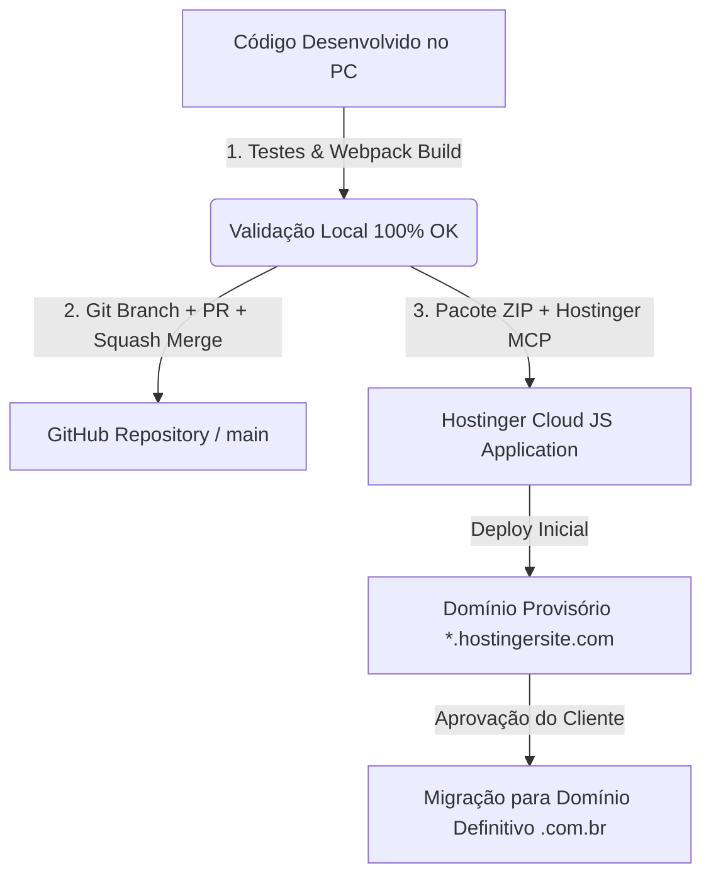

# 🚀 BLUEPRINT MESTRE: E-COMMERCE AGENTIC & CRM PR1ME
> **Framework de Criação Acelerada para E-commerces de Alto Impacto, CRM Inteligente, Automação de Marketing no WhatsApp e Deploy Contínuo (Hostinger + GitHub + Supabase)**

Este documento serve como **manual de arquitetura e prompt mestre** para qualquer Inteligência Artificial (LLM, Agente de Código ou Engenheiro de Software) instanciar um novo projeto de loja virtual em qualquer segmento de mercado (Pet Shop, Moda, Cosméticos, Farmácia, Autopeças, Suplementos, Eletrônicos, etc.), preservando toda a inteligência e esteira de engenharia desenvolvida no ecossistema AgroPet Pr1me.

---

## 📋 FASE 0: PROTOCOLO DE ONBOARDING & DISCOVERY DO CLIENTE
Quando este documento for fornecido a um novo agente ou LLM para iniciar um projeto, a IA **DEVE OBRIGATORIAMENTE** fazer as seguintes 5 perguntas de alinhamento estratégico antes de escrever qualquer código:

```markdown
1. 🎨 IDENTIDADE VISUAL & BRANDING:
   - Qual é o Nome da Loja e o Slogan?
   - Quais são as Cores Principais (Hexadecimal ou tom desejado)?
   - Existe Logotipo ou Mascote oficial? (Se for imagem, podemos recortar o fundo em PNG para destacar na Hero).
   - Qual é o Tom de Voz da marca? (Ex: Acolhedor e rústico, Jovem e dinâmico, Minimalista e luxuoso).

2. 🏷️ SEGMENTO & CATEGORIAS DE PRODUTOS:
   - Qual é o Nicho exato de mercado?
   - Quais são as 4 a 6 Categorias Principais de produtos?
   - Quais são os produtos "Carro-Chefe" (Curva A de faturamento)?

3. 🌐 REFERÊNCIAS VISUAIS DE DESIGN:
   - Você possui referências visuais de sites que gosta (Dribbble, concorrentes líderes, Google Stitch)?
   - Que sensação visual a página inicial deve transmitir ao cliente?

4. 📱 OPERAÇÃO & CONTATOS COMERCIAIS:
   - Qual é o número oficial do WhatsApp Comercial para receber os pedidos?
   - Qual é o Endereço Físico ou Cidade/Estado da operação?
   - Quais são as regras de Frete (Ex: Entrega rápida municipal, Frete Grátis acima de R$ X)?
   - Meios de Pagamento aceitos (PIX Instantâneo, Cartão de Crédito na entrega/online, Boleto, Dinheiro)?

5. ☁️ AMBIENTE & HOSPEDAGEM:
   - O projeto iniciará em Domínio Temporário na Hostinger (para aprovação do cliente) ou já possui domínio próprio registrado?
   - Repositório no GitHub já criado ou a ser inicializado?
```

---

## 🏗️ FASE 1: ARQUITETURA TÉCNICA DO PROJETO

### 1.1. Stack Recomendada
- **Framework Web**: Next.js 15+ (App Router) com React 19 e TypeScript.
- **Estilização**: TailwindCSS + Vanilla CSS para transições refinadas, sombras suaves e micro-interações.
- **Componentes UI**: Radix UI + Lucide React (ícones vetoriais modernos).
- **Gráficos & Business Intelligence**: Recharts (para gráficos de linha, área, rosca e barras).
- **Testes Automatizados**: Vitest (testes unitários ultra-rápidos) + Playwright (testes e2e de ponta a ponta).
- **Banco de Dados & Storage**:
  - **Camada 1 (Client Store Reativa)**: `lib/admin-store.ts` com persistência local e reatividade imediata.
  - **Camada 2 (Database Cloud)**: Supabase (PostgreSQL) para sincronização multi-dispositivo e persistência em nuvem.

### 1.2. Estrutura Canônica de Diretórios
```text
├── app/
│   ├── (site)/
│   │   ├── page.tsx                 # Home Page com Hero Imersiva e Vitrine
│   │   ├── categorias/[slug]/       # Catálogo filtrado por departamento
│   │   ├── produto/[slug]/          # Página do produto com detalhes e botão comprar
│   │   ├── carrinho/                # Carrinho flutuante com cálculo de cashback
│   │   ├── checkout/                # Checkout com captação de dados de CRM
│   │   ├── checkout/sucesso/        # Confirmação pós-pedido
│   │   ├── quem-somos/              # Sobre a empresa e credenciais
│   │   └── contato/                 # Endereço, mapa e canais de atendimento
│   ├── admin/
│   │   ├── page.tsx                 # Dashboard Executivo e resumo de vendas
│   │   ├── produtos/                # Cadastro, edição e exclusão de catálogo
│   │   ├── estoque/                 # Controle Ágil de Estoque (-5, -1, input, +1, +5)
│   │   ├── pedidos/                 # Gestão de Pedidos (online e balcão)
│   │   ├── clientes/                # CRM com Hábitos, Periodicidade e LTV
│   │   ├── marketing/               # Automação de Marketing com WhatsApp Simulator
│   │   └── analytics/               # Power BI Interno Interativo com Slicers
├── components/
│   ├── ui/                          # Botões, inputs, cards e modais
│   ├── admin/sidebar.tsx            # Navegação do Painel Administrativo
│   ├── header.tsx                   # Topo da loja com busca preditiva e carrinho
│   └── footer.tsx                   # Rodapé institucional e links úteis
├── lib/
│   ├── admin-store.ts               # Core de dados: CRM, Pedidos, Estoque e WhatsApp
│   ├── supabase/                    # Conexão e queries com Supabase
│   └── utils.ts                     # Formatação de moeda (R$), datas e textos
└── public/
    └── images/                      # Imagens otimizadas (PNGs com fundo transparente)
```

---

## 🧠 FASE 2: MOTOR DE INTELIGÊNCIA DE NEGÓCIO EMBARCADO

Qualquer projeto gerado por este blueprint **deve incorporar as 4 inteligências centrais**:

### 2.1. CRM de Hábitos de Consumo & Periodicidade Preditiva
- **Dedução Automática de Hábitos**: Cada compra efetuada pelo checkout analisa os itens comprados e infere tags de preferência (ex: *Cães de Grande Porte*, *Gatos Castrados*, *Rações Super Premium*, *Suplementação*).
- **Cálculo de Periodicidade de Recompra**: Estima quantos dias dura o produto (ex: saco de ração dura ~30 dias).
- **Classificação Visual de Risco (RFM Simplificado)**:
  - 🟢 **Ativo**: comprou nos últimos 30 dias.
  - ⚠️ **Em Risco**: entre 31 e 60 dias sem comprar (gatilho de retenção).
  - 🔴 **Inativo (Churn)**: mais de 60 dias sem comprar.
- **Cashback Acumulado**: 5% do valor de cada compra é creditado na conta do cliente como alavanca de retorno.

### 2.2. Réguas de Automação de Marketing no WhatsApp
Quatro réguas nativas configuradas em `/admin/marketing`:
1. **Régua de Reativação de Clientes em Risco (>30d)**:
   - Disparo personalizado com o nome do cliente, tempo sem compras, saldo de cashback acumulado e cupom de incentivo (`VOLTOUPRIME` com frete grátis).
2. **Régua Preditiva de Reposição de Estoque do Cliente**:
   - Disparo automático quando o ciclo estimado de consumo está chegando ao fim (ex: dia 25 de 30).
3. **Régua Preventiva Sazonal / Saúde**:
   - Lembretes periódicos específicos do nicho (ex: antipulgas a cada 30 dias, filtros/óleo para carros, vitaminas para saúde).
4. **Régua de Resgate de Saldo de Cashback**:
   - Notificação para clientes com mais de R$ 15,00 em créditos parados.

### 2.3. Controle Ágil de Estoque em 1 Clique (`/admin/estoque`)
- Operação sem fricção: Botões rápidos `-5`, `-1`, campo numérico editável direto na linha, e botões `+1`, `+5`.
- Alertas visuais em cores:
  - 🔴 **Esgotado**: 0 unidades (Ruptura imediata).
  - ⚠️ **Estoque Baixo**: 1 a 10 unidades (Ponto de reposição).
  - 🟢 **Normal**: mais de 10 unidades.

### 2.4. Power BI & Analytics Interno (`/admin/analytics`)
- **Slicers Interativos**: Filtros dinâmicos por Período (7d, 30d, mês atual), Categoria, Meio de Pagamento e Status do Pedido.
- **KPI Scorecards**: Faturamento Total Líquido, Ticket Médio, Taxa de Recompra/LTV, Clientes em Risco e Cashback Retido.
- **Gráficos Recharts**: Evolução diária/semanal, Gráfico de rosca do mix de faturamento por departamento e barras de canais de pagamento (PIX vs Cartão vs Boleto).
- **Exportação CSV**: Download em 1 clique para análise externa no Excel ou Power BI Desktop.

---

## 🎨 FASE 3: DESIGN SYSTEM & HERO SECTION DE ALTO IMPACTO

### 3.1. Diretrizes da Seção Hero
- **Composição em Duas Colunas**:
  - **Coluna Esquerda (Textual)**: H1 impactante com tipografia forte, proposta de valor clara, badge de frete grátis/entrega rápida, campo de busca com sugestões e botões CTA com micro-interações.
  - **Coluna Direita (Visual)**: Imagem do mascote ou produto principal recortada em **PNG transparente (sem fundo)**, com tamanho ocupando 90-100% da altura da Hero, alinhada à base do container (`object-position: bottom`), criando sensação de profundidade e dinamismo.
- **Cores**: Evitar tons crus genéricos. Usar contrastes escuros elegantes com cores de destaque vibrantes (ciano elétrico, esmeralda, dourado ou roxo moderno).

---

## ⚙️ FASE 4: ENGENHARIA DE DEPLOY EM TRÊS PONTAS



### 4.1. Ponta 1: PC Local
- **Compatibilidade Hostinger Cloud**: Configurar `next.config.js` com:
  ```js
  /** @type {import('next').NextConfig} */
  const nextConfig = {
    reactStrictMode: true,
    typescript: { ignoreBuildErrors: true },
    images: { unoptimized: true }
  };
  module.exports = nextConfig;
  ```
- **Script de Build no `package.json`**: `"build": "next build --webpack"`. (Otimizado para compatibilidade GLIBC Linux em hospedagens compartilhadas).
- **Codificação UTF-8 Estrita**: Salvar todos os arquivos em UTF-8 sem BOM para evitar qualquer corrupção de caracteres acentuados (*mojibake*).

### 4.2. Ponta 2: Governança no GitHub
- Criar Issue com checklist de escopo.
- Criar branch `feature/issue-[N]-[nome]`.
- Fazer commits semânticos (`feat:`, `fix:`, `refactor:`).
- Abrir Pull Request vinculando a Issue (`closes #[N]`).
- Fazer Squash Merge para a branch `main` e atualizar a máquina local com `git pull origin main`.

### 4.3. Ponta 3: Deploy na Hostinger (Domínio Temporário -> Domínio Final)

#### Passo A: Empacotamento Automatizado (Python script)
Incluir apenas os arquivos essenciais no arquivo `source.zip`:
- Pastas: `app/`, `components/`, `hooks/`, `types/`, `lib/`, `public/`.
- Arquivos raiz: `package.json`, `package-lock.json`, `tsconfig.json`, `next.config.js`, `postcss.config.mjs`, `components.json`, `.env.local`.
- **Excluir**: `node_modules/`, `.next/`, `.git/`.

#### Passo B: Deploy via MCP Server da Hostinger
Utilizar a ferramenta `hosting_deployJsApplication`:
```json
{
  "domain": "dominio-temporario-ou-definitivo.com",
  "archivePath": "caminho/para/source.zip",
  "removeArchive": false
}
```
Acompanhar através de `hosting_listJsDeployments` até o status retornar `state: "completed"`.

#### Passo C: Roteiro de Migração de Domínio Definitivo
Quando o cliente adquirir o domínio próprio (`sualoja.com.br`):
1. **No Registro.br ou Provedor de DNS**:
   - Apontar Entrada **A** (Host: `@`) para o IP da VPS/Hospedagem Hostinger.
   - Apontar Entrada **CNAME** (Host: `www`) para o domínio principal.
2. **No Painel da Hostinger**:
   - Adicionar o domínio novo como aplicação Node.js ou alterar o domínio base da aplicação existente.
   - Ativar o certificado **SSL Let's Encrypt Grátis** automático em 1 clique.
   - Executar o mesmo script de deploy apontando para o domínio definitivo.

---

## 🎯 REGRAS DE EXECUÇÃO PARA O AGENTE AUTÔNOMO
1. **Modo Autônomo Total (`/goal`)**: Não interromper o usuário com perguntas simples de interface; tomar as melhores decisões de design, responsividade e arquitetura por padrão.
2. **Sem Placeholders**: Todas as imagens de produtos e banners devem ser funcionais e otimizadas.
3. **Persistência Confiável**: Qualquer alteração efetuada nos menus administrativos (adicionar produto, alterar estoque, excluir pedido, editar cliente) deve persistir em tempo real.
4. **Sincronização Tríplice Obrigatória**: Qualquer entrega final só é considerada concluída quando estiver validada **no PC local**, mergeada **no GitHub** e rodando **com Status 200 OK na Hostinger**.

---
*Blueprint oficial compilado a partir do projeto modelo AgroPet Pr1me.*